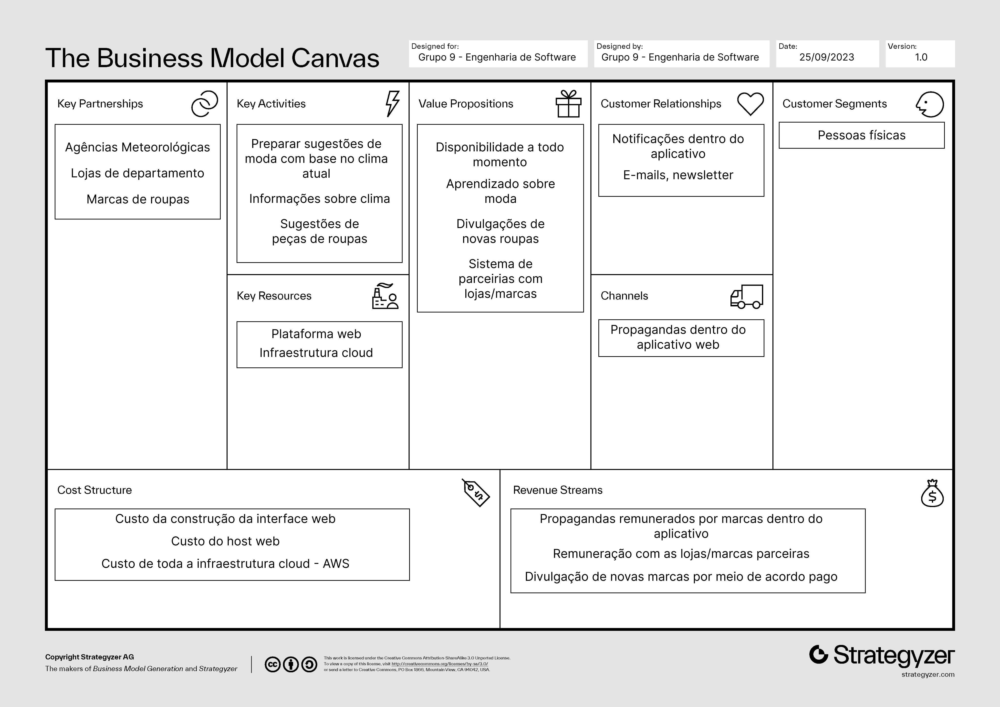
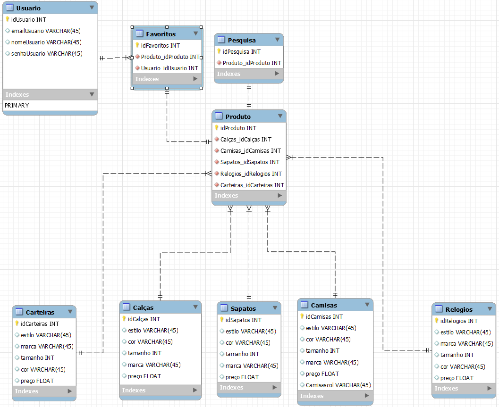

# Projeto Final – Grupo 9

Aqui está o documento compactando todo o projeto feito pelo Grupo 9 de Engenharia de Software - UCB - GPE17M0244.

Link do Trello trabalhado com a equipe: [Grupo 9 - Engenharia de Software | Trello](https://trello.com/b/9a83qfR4/grupo-9-engenharia-de-software);

Link do repositório do GitHub em que está inserido o documento de compactação: [Grupo-9-Engenharia-De-Software-UCB/projeto-final (github.com)](https://github.com/Grupo-9-Engenharia-De-Software-UCB/projeto-final);

Link com as perguntas elaboradas para a dinâmica em grupo: [Perguntas para a dinâmica - Documentos Google](https://docs.google.com/document/d/1iD41pPqv2izgb07XvdBZfFDPaF4uXJ-nlEVpW8FFvaM/edit);

Link da apresentação do Grupo 9: [final.mp4 - Google Drive](https://drive.google.com/file/d/12ZwpcAfnwu0Z7p6pOC8a1_ER8hrhtH2h/view);

Imagem com o Business Model Canvas (BMC) do projeto:

Link da planilha de preços da aplicação: [climastyle atualizado 2023 - Planilhas Google](https://docs.google.com/spreadsheets/d/1EnNFhsG5_4CDj7f5a3di8tlFC5EKBIFzNUYDRCAlGS8/edit#gid=1739102586);

Link com o protótipo do projeto no Figma: [Protótipo – Figma](https://www.figma.com/file/VQRZAoPzYaGE5TD7AL8i9w/Prot%C3%B3tipo?type=design&node-id=0-1&mode=design&t=tqF0AFTB15mzaov4-0)

Imagem do modelo conceitual do projeto:

Alunos: 

**Guilherme Ribeiro Soares** – UC21200089;

**Renan Gama** -  UC23102230;

**Moziel Sirley Alves de Souza** - UC23100729;

**Pedro Gustavo da Rocha Soares Caixeta** - UC23100844;

**Luiz Felipe** - UC23100072;

**Alfredo Gustavo** - ?;

**Rafael Vaz Cavalcanti** - UC21200047; 
